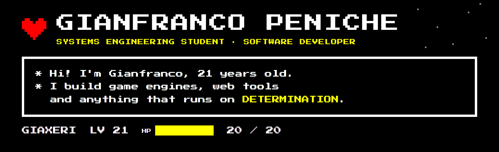
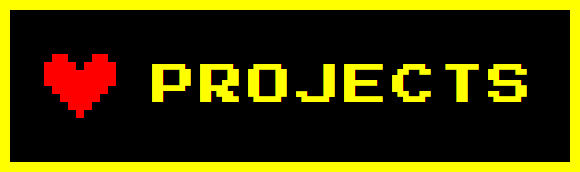
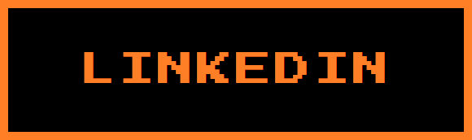

<div align="center">



<a href="https://github.com/Giaxeri">
  
</a>

<p>
  <a href="https://github.com/Giaxeri?tab=repositories"></a>
  <a href="https://www.linkedin.com/in/gianfranco-peniche-uribe-8b154a3b8/"></a>
  <a href="mailto:penichegianfranco@gmail.com"></a>
  <a href="https://giaxeri.github.io/Determination-Battle-Simulator/"></a>
</p>


</div>

---

## ❤️ About Me

```javascript
const gianfranco = {
  role: "Systems Engineering Student",
  age: 21, // LV 21 ❤
  semester: "8th",
  university: "Universidad El Bosque",
  location: "Bogotá, Colombia",
  languages: ["Spanish (native)", "English (C1)", "French (basic)"],

  code: ["C++17", "TypeScript", "JavaScript", "Java", "Python", "C#", "PHP", "SQL"],

  builtWith: ["Angular", "Electron", "Node.js", "raylib", "JSF / PrimeFaces", "HTML5 Canvas"],

  interests: [
    "Software Development",
    "Game Engines & Tools",
    "Databases",
    "Cybersecurity",
    "Systems Architecture"
  ],

  lookingFor: "A software development internship 🚀"
};
```

I like understanding how systems work **under the hood** — game engines, binary file formats, networks and
cryptography — and turning that knowledge into tools that are clear, fast and well documented.

---

## 🎒 ITEM · Languages & Tools

<div align="center">

<br><br>


</div>

---

## 💬 ACT · Engineering Philosophy

<table>
  <tr>
    <td width="33%" valign="top">
      <h3>🔍 Understand the System</h3>
      Before writing code, I want to know how things really work — from a <code>data.win</code> binary format to an IPv4 subnet.
    </td>
    <td width="33%" valign="top">
      <h3>🧩 Decoupled by Design</h3>
      Clear contracts between components (like a JSON Schema between an editor and an engine) keep software easy to evolve.
    </td>
    <td width="33%" valign="top">
      <h3>📝 Document Everything</h3>
      A project is only finished when someone else can install it, run it and understand it from its README.
    </td>
  </tr>
</table>

---

## ⚔️ FIGHT · Featured Projects

| Project | What it is | Stack |
|---|---|---|
| 🐝 **[HoneyComb Engine](https://github.com/dannn-36/HoneyCombEngine-PlataformaNoCode-2.5D)** | NoCode platform for isometric 2.5D games: a visual editor and a native runtime decoupled through a JSON Schema contract. I built editor & engine features and the cross-platform installer. *(Team of 3)* | C++17 · raylib · Angular · Electron · CMake |
| ❤️ **[Determination Battle Simulator](https://github.com/Giaxeri/Determination-Battle-Simulator)** · [▶ Play](https://giaxeri.github.io/Determination-Battle-Simulator/) | Browser recreation of 9 UNDERTALE boss fights with 136 attacks. Custom zero-dependency engine, frame interpolation, Python binary asset extractor, EN/ES. | JavaScript · Canvas · Web Audio · Python |
| 🔐 **[Classical Cryptanalysis](https://github.com/Giaxeri/criptoanalisis-clasico)** · [▶ Try it](https://giaxeri.github.io/criptoanalisis-clasico/) | Breaks Caesar, Affine and Vigenère ciphers using index of coincidence, chi-squared and the Kasiski method (27-letter Spanish alphabet). | JavaScript · HTML5 |
| 🎰 **[Betting House Manager](https://github.com/Giaxeri/PRF_PROG1_20232_EspitiaAlejandra_GuerreroValentina_HernandezJuanPablo_PenicheGianfranco)** | Desktop app to manage branches, bettors, 5 games and reports. MVC + DAO/DTO, file persistence and 123 unit tests. | Java · Swing · JUnit |
| 📻 **[Kubaru Forrest M](https://github.com/Giaxeri/KUBARUFORRESTM_FRONTEND)** | Web frontend to manage radio stations and songs with a built-in audio player, consuming a REST API. | Java EE · JSF · PrimeFaces · REST |
| 🌐 **[IPv4 Subnet Calculator](https://github.com/Giaxeri/Redes-Maquina-Virtual)** | Network, broadcast, host range, class and type from an IP and mask, with a binary view. Deployed on Apache in a VM. | PHP · Apache |

---

## 📊 STATS · GitHub Dashboard

<div align="center">


</div>

### 🔥 Contribution Streak

<div align="center">


</div>

### 📈 Activity

<div align="center">


</div>

---

## ⭐ SAVE POINT · Currently Learning

<table>
  <tr>
    <td>🏗️ Software Architecture</td>
    <td>🗄️ Database Design & SQL</td>
    <td>🛡️ Cybersecurity</td>
  </tr>
  <tr>
    <td>☁️ Cloud with AWS</td>
    <td>🧪 Testing & Quality</td>
    <td>⚙️ C++ & Systems Programming</td>
  </tr>
</table>

## ✨ What I Love Building

- 🎮 **Game engines & developer tools**
- 🕹️ **Interactive web experiences** with no heavy dependencies
- 🖥️ **Desktop applications** with Electron and native runtimes
- 🔐 **Security & cryptography tools**
- 🧩 **Data-driven systems** with clear contracts between components
- 📦 **Installers & automation** that make projects easy to run

## 🏆 EXP · Achievements

- 🥇 **Winner — Innovation Section**, *We Are Energy* contest by **ENEL**. Prize: a trip to the *"The Energy of Things"* camp near Rome, Italy.

---

## 💛 MERCY · Let's Connect

<div align="center">

<a href="https://www.linkedin.com/in/gianfranco-peniche-uribe-8b154a3b8/"></a>
<a href="mailto:penichegianfranco@gmail.com"></a>

**Code • Systems • DETERMINATION**


</div>
